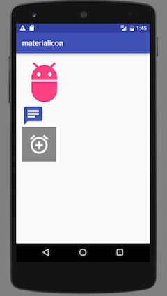
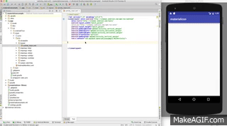

You can easily have over 1,000 public Google Material Design icons(https://design.google.com/icons) can be used in Android.
To produce the image as font ttf support any size with the vector method.

[](https://github.com/kmshack/Android-MaterialIconView)

 
 


  
  
Instructions
-----------

* “com.kmshack.materialicon.MIView" custom made supports three attributes. iconName is setting the icons name of the material. A name that starts with "mi_" has already been defined by the String resource.
iconColor is setting the color values of the icon and the color information, iconSize is setting the size of the icon.


```xml
<LinearLayout xmlns:android="http://schemas.android.com/apk/res/android"
    xmlns:mi="http://schemas.android.com/apk/res-auto"
    android:layout_width="match_parent"
    android:layout_height="match_parent">
    
    <com.kmshack.materialicon.MIView
        android:layout_width="wrap_content"
        android:layout_height="wrap_content"
        android:background="#888"
        android:padding="16dp"
        mi:iconColor="#FFF"
        mi:iconSize="60dp"
        mi:iconName="@string/mi_add_alarm"/>

</LinearLayout>

```





Very easy.


* Vector system much easier way than the image with each of the resources can be used a number of icons can be a material with a small capacity of 100kb.

  


Video
-----------
https://youtu.be/9UsDR9cxn5w


Licensed
-----------

Licensed under the Apache License, Version 2.0 (the "License");
you may not use this file except in compliance with the License.
You may obtain a copy of the License at

   http://www.apache.org/licenses/LICENSE-2.0

Unless required by applicable law or agreed to in writing, software
distributed under the License is distributed on an "AS IS" BASIS,
WITHOUT WARRANTIES OR CONDITIONS OF ANY KIND, either express or implied.
See the License for the specific language governing permissions and
limitations under the License.


  

